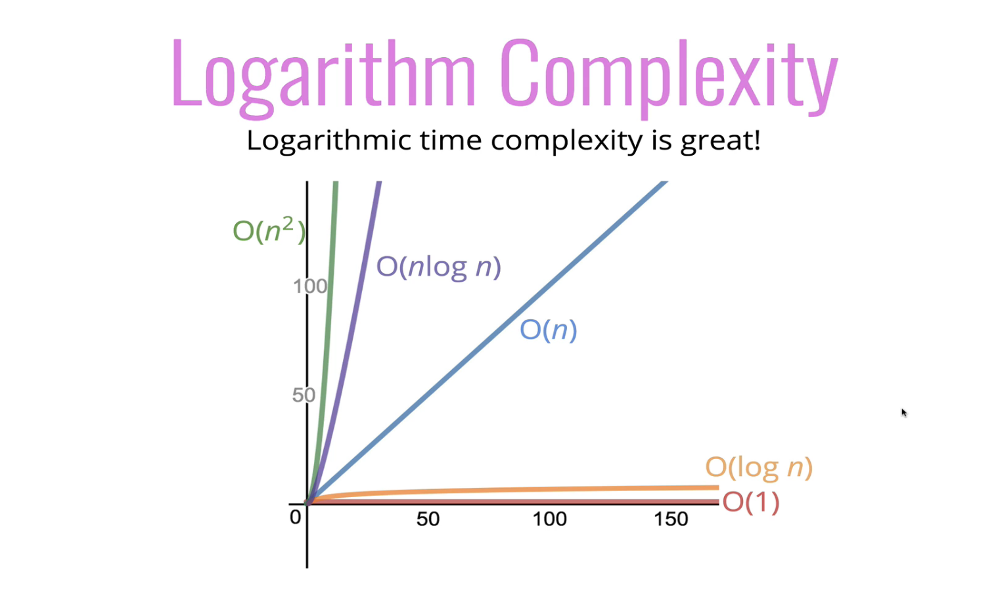
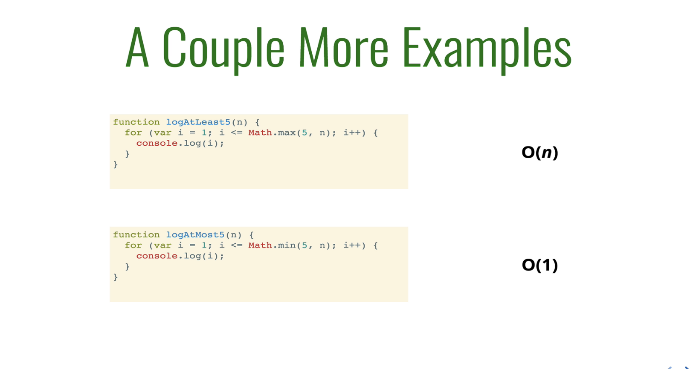
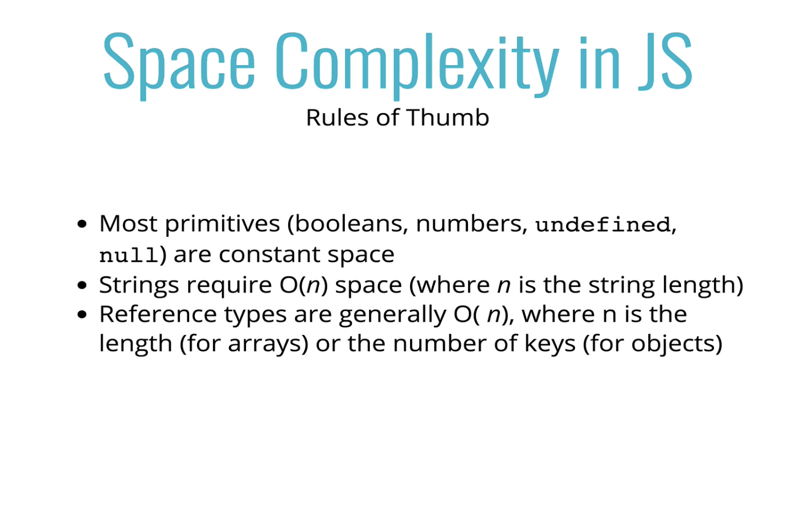
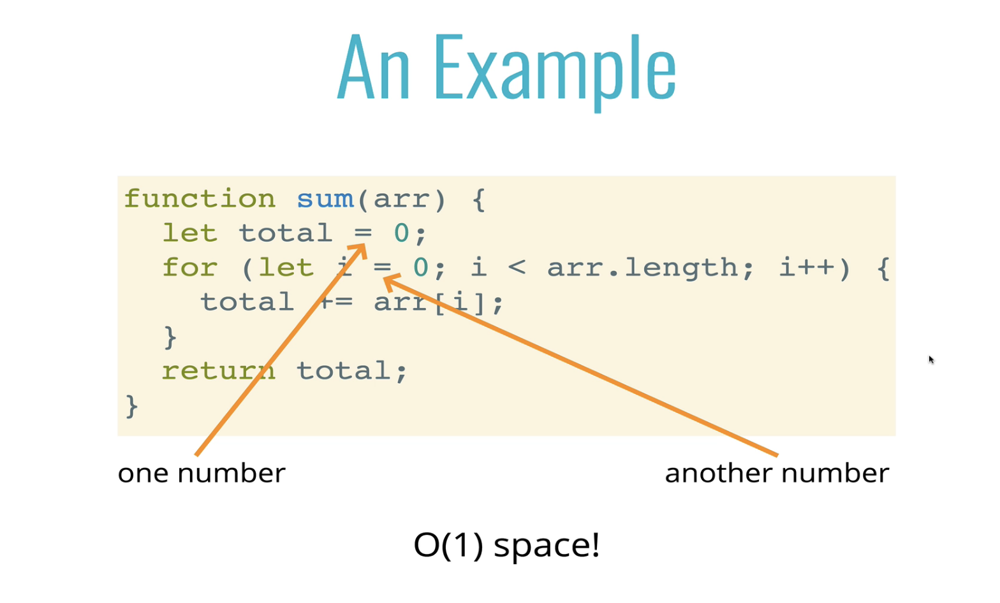
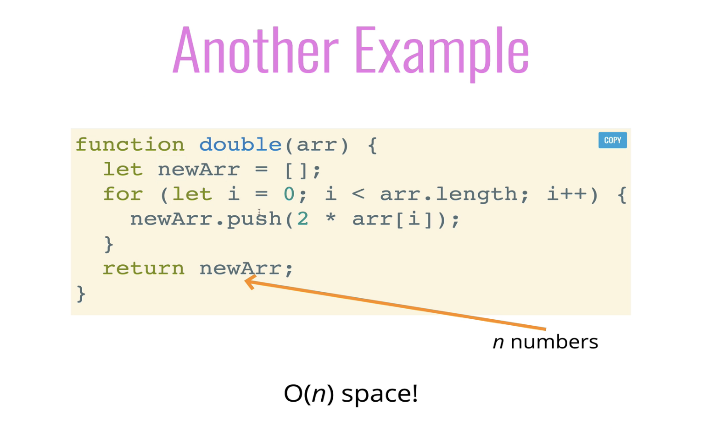
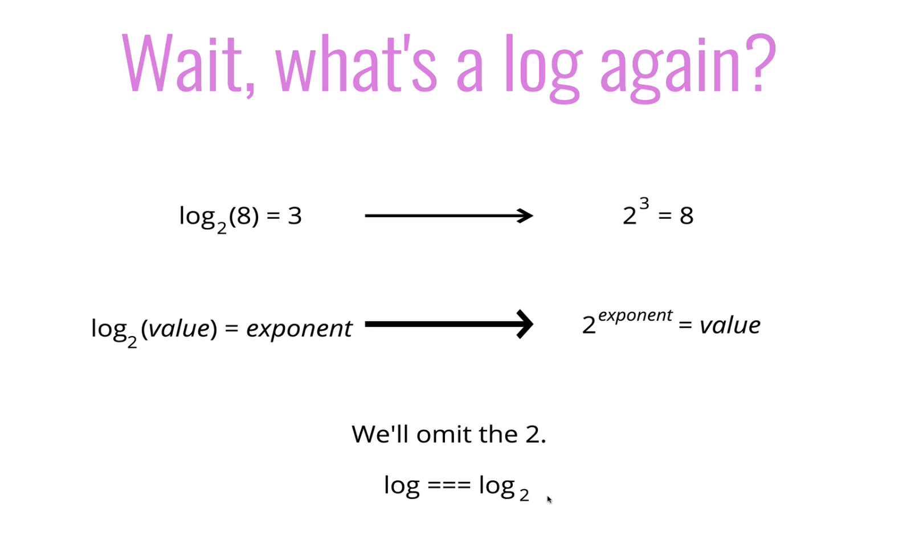
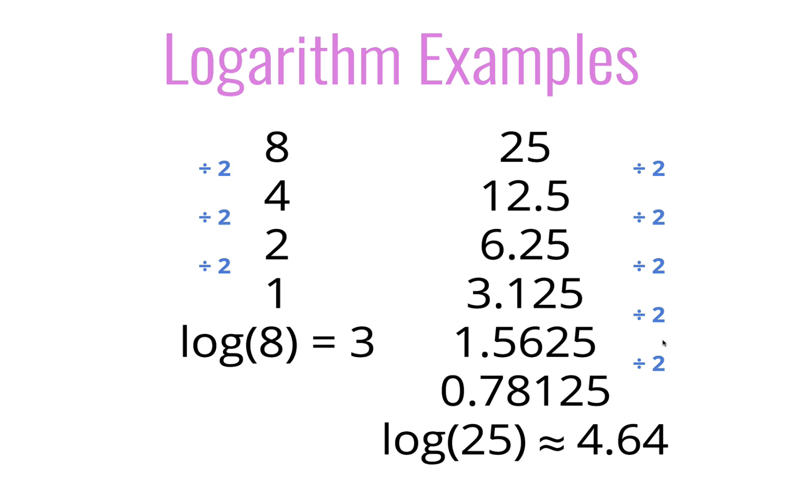
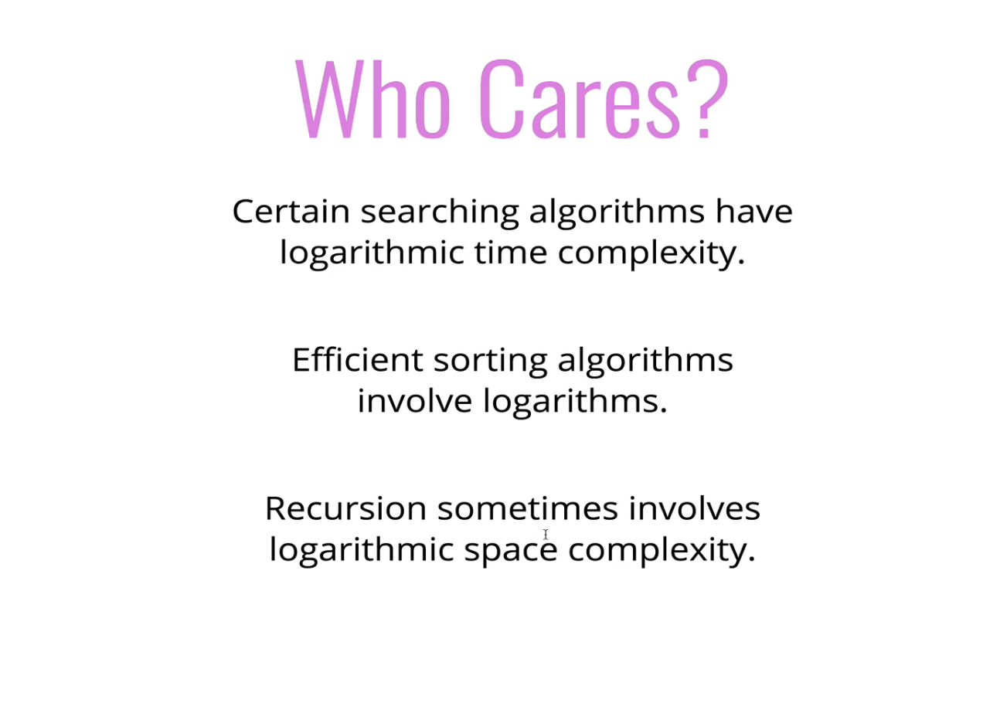
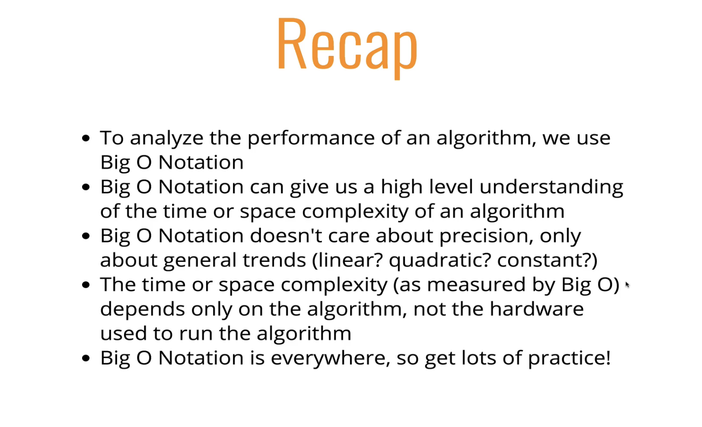

# DSA2.0

- Count operations in BigO rather than counting time a computer will take to handle operation
- When n argument grows, the operations scale with it, `n = 500`, we will loop through this 500 times, so this is not viable
- Depending on what we count, the number of operations can be as low as `2n` or as high as `5n + -` but regardless of the exact number, the number of operations grows roughly proportionally with `n`

## Big O Notation

- We say an algorithm is `O(f(n))` if the number of simple operations the computer has to do eventually less than a constant times `f(n)`, as `n` increases.

  - `f(n)` could be linear `(f(n) = n)` runtime grows relative to n
  - `f(n)` could be quadratic `(f(n) = n²)` as n increases, runtime increases at n²
  - `f(n)` could be constant `(f(n) = 1)` constant as n grows
  - `f(n)` could be something entirely different

  **NB**: When `0(n)` is inside an `0(n)` operation it is `0(n²)`, runtime keeps growing

- Is a way of formalized fuzzy counting
- Ways of describing relationship between the input to a function as it grows it grows and how that changes runtime of that function
- It allows us to talk formally about how the runtime of an algorithm grows as the input grows

### Big O ShortHands

- Arithmetic operations are constant, pc takes same time to calc `1 + 1`
- Variable assignment is constant
- Accessing elements in an array (by index) or object (by key) is constant
- In a loop, the complexity is the length of the loop times the complexity of whatever happens inside of the loop

### What's best?

- `O(1)` - A much better runtime
- `O(log n)` -
- `O(n)` - linear runtime
- `O(nlog n)` -
- `O(n²)` -

## Space Complexity

- Auxiliary space complexity refers to space required by the algorithm, not including space taken up by inputs
- Repercussions inside algorithm, cares about the algorithm it's self
- Space complexity basically means we are talking about the auxillary complexity

### What takes up space?

- No matter how much size of an array or n grows, it doesn't have a huge impact on space, in example below, we are not recreating variable inside the loop, we are just appending to it, so it will be O(1)!

### What is a logarithm?

- `Binary logarithm` of a number roughly measures the number of times you can divide that number by 2 before you get a value that's less than or equal to one
  

- Its is actually compared to O(1), the larger n gets, it doesn't grow that much, but it grows a lot to proportion to log(n)

# Recap

